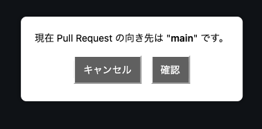
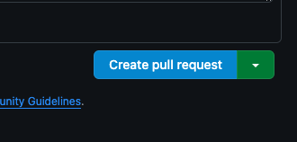

# git-pr-dest-checker

GitHub で Pull Request を作成した際に base branch が正しいか確認するためのダイアログを表示します。

## インストール手順

1. git cloneする。
2. chrome://extensions/ をブラウザで開く
3. 「デベロッパーモード」をオンにする（右上あたり）
4. 「パッケージ化されていない拡張機能を読み込む」ボタンから、cloneした my-github-confirm-extension ディレクトリを選択
5. 読み込みが成功すると、拡張機能がリストに表示される
6. GitHub の compare page (Pull Request 作成画面) で "Create pull request" を押せば、ダイアログが表示される

## 確認方法

"Create pull request" や "Merge pull request" ボタンが青色になっていれば有効化されています。

